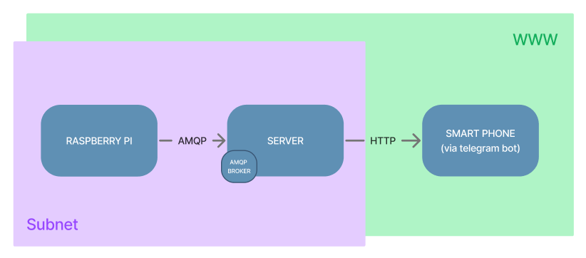
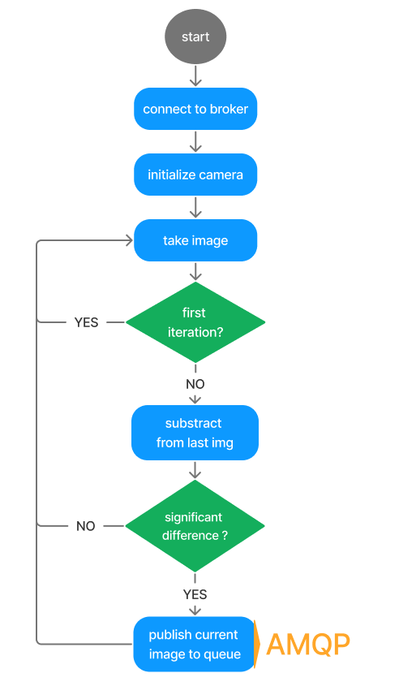
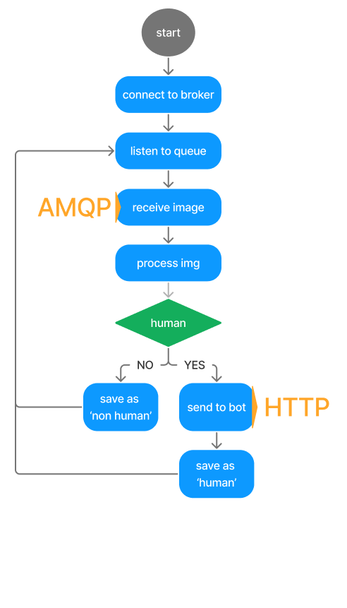
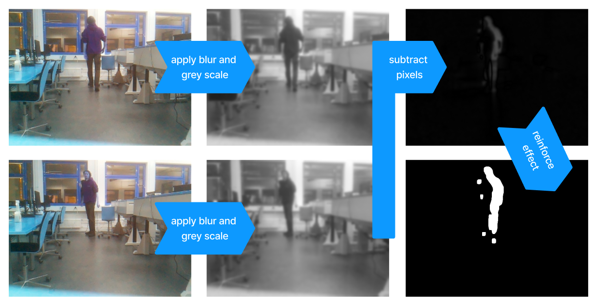
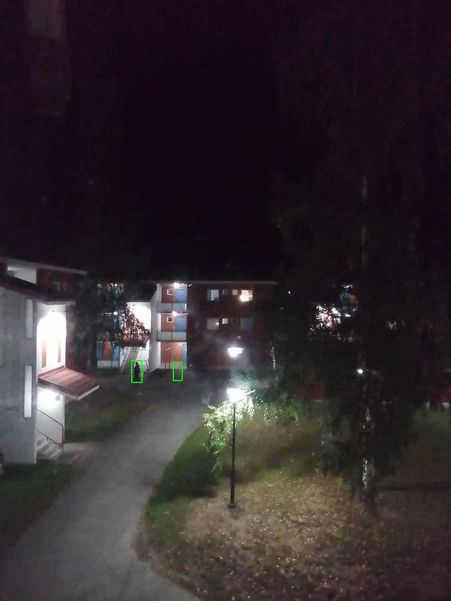
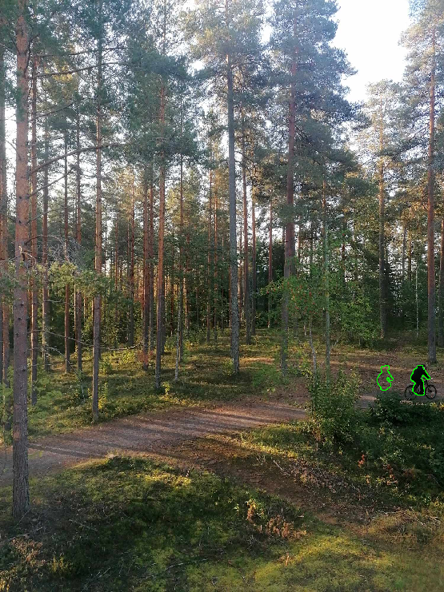

# WatchDogPi
Course: Applying IoT 
Semester: 7

This is the result of the semester project at the Applying IoT course at the XAMK South-Eastern Finland University of 
Applied Sciences during my semester abroad.  
 
The WatchDogPi system has a Raspberry Pi with a camera as sensor node that observes an area. When a motion is detected,
the Raspberry Pi send the most recent image via a RabbitMQ message queue to a server. The server than uses the openCV 
HOG Descriptor People Detector to search for humans in this image. If a human can be detected, the server uploads 
the image to a Telegram Bot that than notifies the user with posting the image to a chat.

## Used Technologies 

## System Overview 

## Algorithm Overview
The diagrams model the processing steps done by the python scripts on a high level. This design step helped to 
understand how the system should work and what functionality had to be implemented.

| **Raspberry Pi**                                                                           | **Server**                                                                                 |
|--------------------------------------------------------------------------------------------|--------------------------------------------------------------------------------------------|
|  |  |

## Motion Detection in Pictures
To detect a motion in the observed scene the sensor node continuously takes images and calculates the difference between
the two most recent ones. If the area of the calculated difference is bigger than a threshold a motion is detected. 

With few adjustments in the code the areas that have changed can be highlighted by drawing the outlines or a frame. It
was a lot of fun playing around with the motion detection and setting the parameters right. For the forest view for 
example it was necessary to find a sweet spot in between the differences created by the leafs in 
wind and actual humans. 

|  |  |
|--------------------------------------------------------------------------------------|--------------------------------------------------------------------------------------|

